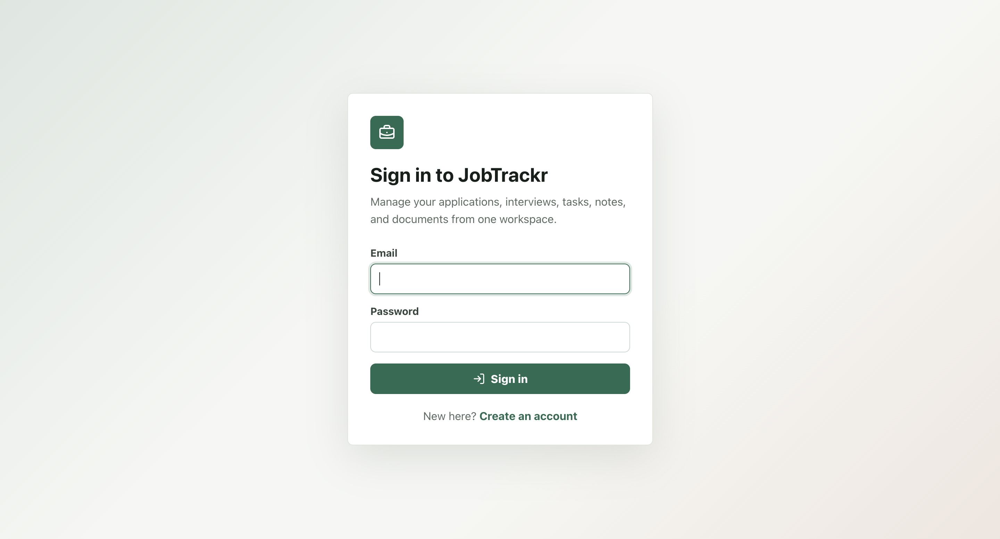
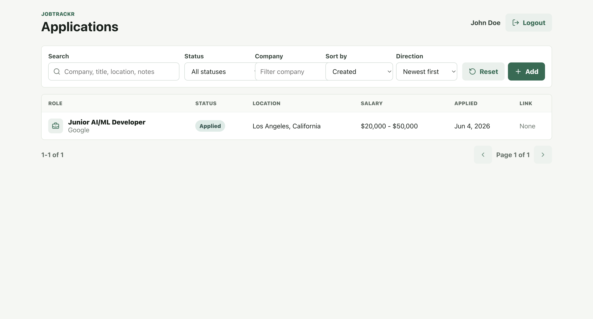
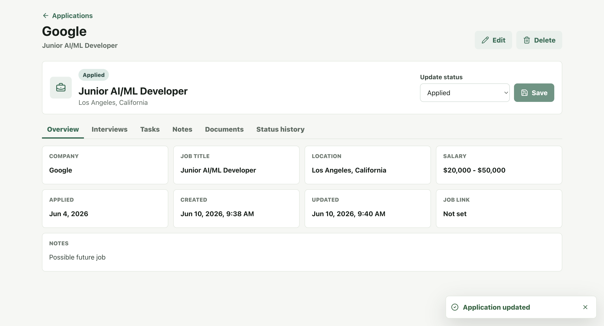
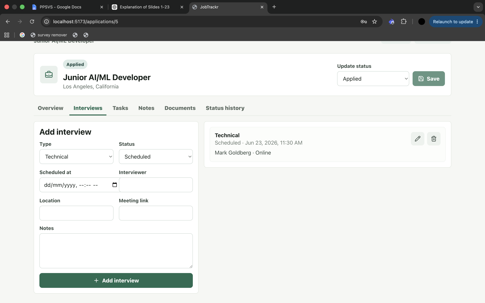
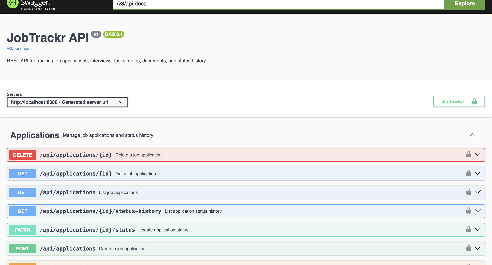

# JobTrackr

JobTrackr is a full-stack job application tracking system for managing applications, interviews, follow-up tasks, notes, documents, and application status history. It is built as a portfolio-ready project that demonstrates secure REST API design, PostgreSQL persistence, JWT authentication, owner-based authorization, database migrations, OpenAPI documentation, Docker-backed integration testing, and a React/TypeScript frontend.

## Tech Stack

- Java 21
- Spring Boot 3
- Spring Web
- Spring Security
- JWT authentication
- Spring Data JPA / Hibernate
- PostgreSQL
- Flyway database migrations
- Jakarta Bean Validation
- Docker Compose
- Swagger / OpenAPI with Springdoc
- JUnit 5, Mockito, Testcontainers
- Maven
- React
- TypeScript
- Vite
- TanStack Query
- Axios
- React Router
- Lucide React

## Features

- User registration and login with JWT access tokens
- BCrypt password hashing
- Stateless Spring Security configuration
- Authenticated user ownership checks for protected resources
- Job application CRUD
- Application status history
- Filtering, pagination, and sorting for applications
- Interview management per job application
- Task/reminder management per job application
- Notes per job application
- Document links per job application
- Global exception handling with consistent API error responses
- DTO-based request/response models
- Flyway-managed PostgreSQL schema
- Swagger UI documentation
- Unit tests and PostgreSQL integration tests with Testcontainers
- React frontend with login/register, protected routes, application dashboard, detail view, resource tabs, toast notifications, loading states, and confirmation dialogs

## Screenshots

### Login



### Applications Dashboard



### Application Detail



### Resource Tabs



### Swagger UI



## Architecture

The project follows a layered backend structure:

```txt
Controller -> Service -> Repository -> Database
```

Main packages:

```txt
com.moustafa.jobtrackr
+-- application
+-- auth
+-- common
+-- config
+-- document
+-- health
+-- interview
+-- note
+-- security
+-- task
+-- user
```

Entities are not exposed directly from controllers. API boundaries use DTOs for request validation and response shaping.

## Getting Started

### Prerequisites

- Java 21
- Maven
- Docker Desktop

Check Java:

```bash
java -version
```

### Start PostgreSQL

```bash
docker compose up -d
```

PostgreSQL runs inside Docker on container port `5432`, mapped to host port `5433`.

Database credentials:

```txt
Database: jobtrackr_db
Username: jobtrackr_user
Password: jobtrackr_password
Host: localhost
Port: 5433
```

pgAdmin is available at:

```txt
http://localhost:5050
```

pgAdmin login:

```txt
Email: admin@jobtrackr.com
Password: admin
```

### Run the API

```bash
mvn spring-boot:run
```

The app defaults to the `dev` profile, which uses the Docker Compose PostgreSQL settings from `application-dev.properties`.

The API runs at:

```txt
http://localhost:8080
```

Health check:

```bash
curl http://localhost:8080/api/health
```

### Run the Frontend

Install frontend dependencies:

```bash
cd frontend
npm install
```

Start the Vite dev server:

```bash
npm run dev
```

The frontend runs at:

```txt
http://localhost:5173
```

The frontend uses this API base URL by default:

```txt
VITE_API_BASE_URL=http://localhost:8080
```

### Run the Full App Locally

Terminal 1:

```bash
docker compose up -d
mvn spring-boot:run
```

Terminal 2:

```bash
cd frontend
npm install
npm run dev
```

Open:

```txt
http://localhost:5173
```

Create an account from the Register page, then use the app to create applications and manage interviews, tasks, notes, documents, and status changes.

### Frontend Production Build

```bash
cd frontend
npm run build
```

## Authentication Flow

Register a user:

```bash
curl -X POST http://localhost:8080/api/auth/register \
  -H "Content-Type: application/json" \
  -d '{
    "fullName":"Demo User",
    "email":"demo@example.com",
    "password":"password123"
  }'
```

Login:

```bash
curl -X POST http://localhost:8080/api/auth/login \
  -H "Content-Type: application/json" \
  -d '{
    "email":"demo@example.com",
    "password":"password123"
  }'
```

Use the returned token:

```bash
TOKEN="PASTE_TOKEN_HERE"
```

Get current user:

```bash
curl http://localhost:8080/api/auth/me \
  -H "Authorization: Bearer $TOKEN"
```

## Core API Examples

Create a job application:

```bash
curl -X POST http://localhost:8080/api/applications \
  -H "Authorization: Bearer $TOKEN" \
  -H "Content-Type: application/json" \
  -d '{
    "companyName":"Google",
    "jobTitle":"Backend Engineer",
    "location":"Remote",
    "status":"APPLIED",
    "applicationDate":"2026-06-01",
    "notes":"Applied through company careers page."
  }'
```

List applications:

```bash
curl "http://localhost:8080/api/applications?page=0&size=10&sort=createdAt,desc" \
  -H "Authorization: Bearer $TOKEN"
```

Filter applications:

```bash
curl "http://localhost:8080/api/applications?status=INTERVIEW&search=backend" \
  -H "Authorization: Bearer $TOKEN"
```

Filter and sort applications together:

```bash
curl "http://localhost:8080/api/applications?status=INTERVIEW&company=Google&page=0&size=10&sort=applicationDate,desc" \
  -H "Authorization: Bearer $TOKEN"
```

Search applications across company, title, location, and notes:

```bash
curl "http://localhost:8080/api/applications?search=backend&sort=companyName,asc" \
  -H "Authorization: Bearer $TOKEN"
```

Supported application sort fields:

```txt
createdAt
updatedAt
applicationDate
companyName
jobTitle
status
```

Set an application id:

```bash
APP_ID=1
```

Create an interview:

```bash
curl -X POST http://localhost:8080/api/applications/$APP_ID/interviews \
  -H "Authorization: Bearer $TOKEN" \
  -H "Content-Type: application/json" \
  -d '{
    "type":"TECHNICAL",
    "scheduledAt":"2026-06-10T15:00:00Z",
    "location":"Remote",
    "meetingLink":"https://meet.example.com/interview",
    "interviewerName":"Jane Recruiter",
    "notes":"Review Java, Spring Boot, and PostgreSQL."
  }'
```

Create a task:

```bash
curl -X POST http://localhost:8080/api/applications/$APP_ID/tasks \
  -H "Authorization: Bearer $TOKEN" \
  -H "Content-Type: application/json" \
  -d '{
    "title":"Send thank-you email",
    "description":"Mention the technical interview discussion.",
    "dueAt":"2026-06-11T12:00:00Z"
  }'
```

Complete a task:

```bash
TASK_ID=1

curl -X PATCH http://localhost:8080/api/tasks/$TASK_ID/complete \
  -H "Authorization: Bearer $TOKEN"
```

Create a note:

```bash
curl -X POST http://localhost:8080/api/applications/$APP_ID/notes \
  -H "Authorization: Bearer $TOKEN" \
  -H "Content-Type: application/json" \
  -d '{
    "content":"Recruiter said feedback should arrive next week."
  }'
```

Create a document link:

```bash
curl -X POST http://localhost:8080/api/applications/$APP_ID/documents \
  -H "Authorization: Bearer $TOKEN" \
  -H "Content-Type: application/json" \
  -d '{
    "name":"Google backend resume",
    "type":"RESUME",
    "url":"https://example.com/google-resume.pdf",
    "notes":"Tailored resume emphasizing Java and Spring Boot."
  }'
```

List document links:

```bash
curl http://localhost:8080/api/applications/$APP_ID/documents \
  -H "Authorization: Bearer $TOKEN"
```

## API Endpoints

### Health

```txt
GET /api/health
```

### Auth

```txt
POST /api/auth/register
POST /api/auth/login
GET  /api/auth/me
```

### Applications

```txt
GET    /api/applications
POST   /api/applications
GET    /api/applications/{id}
PUT    /api/applications/{id}
GET    /api/applications/{id}/status-history
PATCH  /api/applications/{id}/status
DELETE /api/applications/{id}
```

### Interviews

```txt
GET    /api/applications/{applicationId}/interviews
POST   /api/applications/{applicationId}/interviews
PUT    /api/interviews/{id}
DELETE /api/interviews/{id}
```

### Tasks

```txt
GET    /api/applications/{applicationId}/tasks
POST   /api/applications/{applicationId}/tasks
PATCH  /api/tasks/{id}/complete
DELETE /api/tasks/{id}
```

### Notes

```txt
GET    /api/applications/{applicationId}/notes
POST   /api/applications/{applicationId}/notes
DELETE /api/notes/{id}
```

### Documents

```txt
GET    /api/applications/{applicationId}/documents
POST   /api/applications/{applicationId}/documents
DELETE /api/documents/{id}
```

## Swagger / OpenAPI

Start the app, then open:

```txt
http://localhost:8080/swagger-ui/index.html
```

OpenAPI JSON:

```txt
http://localhost:8080/v3/api-docs
```

Most endpoints require JWT authentication. In Swagger UI, use the `Authorize` button and enter:

```txt
Bearer YOUR_TOKEN
```

## Database Migrations

Flyway migrations live in:

```txt
src/main/resources/db/migration
```

Current migration:

```txt
V1__create_initial_schema.sql
V2__create_application_status_history.sql
V3__create_documents.sql
```

Hibernate is configured with:

```properties
spring.jpa.hibernate.ddl-auto=validate
```

That means Flyway owns schema creation and Hibernate validates that the entity mappings match the database.

## Testing

Run backend tests:

```bash
mvn test
```

Run frontend build verification:

```bash
cd frontend
npm run build
```

The test suite includes:

- Unit tests for services and JWT behavior
- Integration tests that start the Spring Boot app on a random port
- PostgreSQL integration testing with Testcontainers
- Auth, owner authorization, child resource, and OpenAPI verification

The first Testcontainers run may take longer because Docker needs to pull images.

## Configuration

Profile-based config files:

```txt
src/main/resources/application.properties
src/main/resources/application-dev.properties
src/main/resources/application-prod.properties
```

The base config contains shared settings. The `dev` profile contains local Docker defaults. The `prod` profile requires environment variables for database credentials and JWT signing.

Example local environment file:

```txt
.env.example
```

Production environment variables:

```bash
export SPRING_PROFILES_ACTIVE=prod
export DATABASE_URL="jdbc:postgresql://your-host:5432/jobtrackr_db"
export DATABASE_USERNAME="jobtrackr_user"
export DATABASE_PASSWORD="replace-with-a-secure-password"
export JWT_SECRET="replace-with-a-long-random-secret"
export JWT_EXPIRATION_MINUTES=60
```

For local development, you can override the default JWT secret without switching profiles:

```bash
export JWT_SECRET="replace-with-a-long-random-secret"
```

## Resume Summary

```txt
JobTrackr - Full-Stack Job Application Management System
- Built a full-stack job application tracker using Spring Boot, PostgreSQL, React, and TypeScript.
- Designed a secure REST API for tracking job applications, interviews, tasks, notes, document links, and status history.
- Implemented JWT authentication, BCrypt password hashing, stateless Spring Security, and owner-based authorization.
- Designed relational JPA entities with Flyway-managed PostgreSQL migrations and DTO validation.
- Tracked application status transitions with historical audit records.
- Added filtering, pagination, sorting, global exception handling, and Swagger/OpenAPI documentation.
- Wrote unit and Docker-backed integration tests using JUnit, Mockito, and Testcontainers.
- Built a React frontend with protected routes, dashboard filtering/sorting, detail tabs, toast notifications, confirmation dialogs, and loading/error states.
```

## Future Improvements

- File upload/storage for documents
- Task update and reopen endpoints
- Note update endpoint
- Role-based admin endpoints
- Docker Compose support for serving the production frontend
- Hosted deployment
